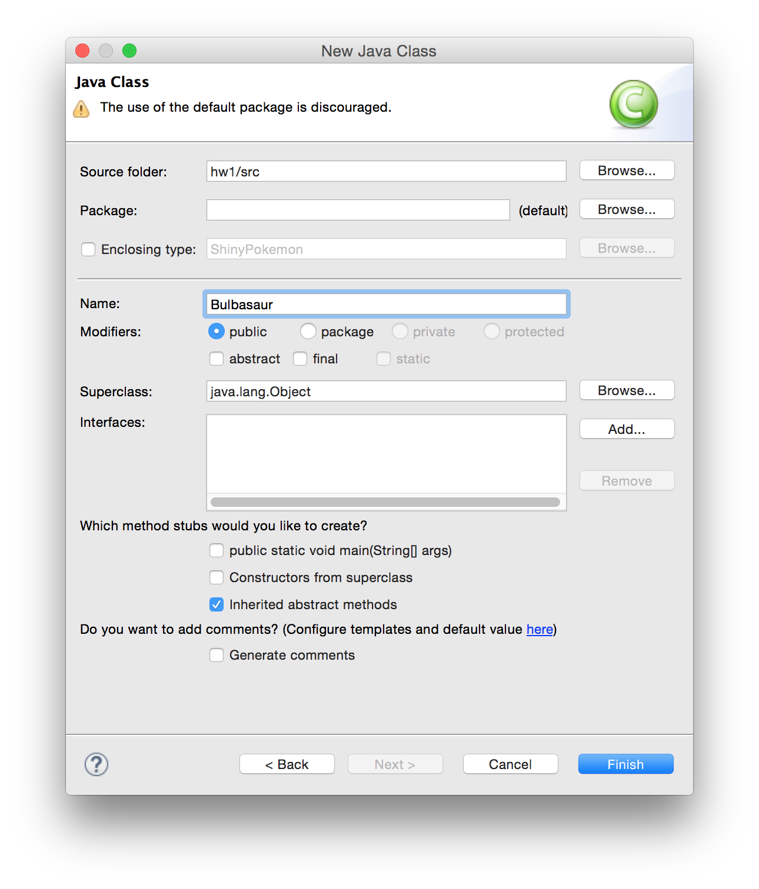

This is a short but important collection of coding standards that we expect you to follow for this class. You will find that adhering to this code results in readable, maintainable, and easy to debug code. Beyond this class, you will find that good code style is essential not only for yourself but also for any large codebase engineered by a team of developers.

We do not claim ownership over these tips. Rather, they are inspired by [Google's Java Style Guide](https://google.github.io/styleguide/javaguide.html) which we encourage you to spend 7 minutes reading. Multiple TAs over the generations (Linan Qiu, James Lin, Andrew Goldin, Madhavan Somanathan) have also contributed to this guide.

# Source File Basics

## File Name

Source file name consists of the name of the class plus the `.java` extension.

## File Encoding

Source files can be either UTF-8 or ASCII.

## File Header

Include your name, UNI, and description of the file in each Java source file that you write. This allows you to quickly identify the author of the code and the code's purpose.

```java
/* James Lin
 * jl3782
 * HanSolo.java - creating a child thread kills this class
 */

public class HanSolo {
  // ...
}
```

## Use Default Package

**Use the default package for all your classes**. That means instead of declaring your class file as such:

```java
package somepackage;

public class Bulbasaur {
  // ...
}
```

You should only have

```
public class Bulbasaur {
  // ...
}
```

Since this course does not require packages, you usually end up creating classes within packages as a result of IDEs' over-helpfulness. Make sure you leave the package row empty when you create a new class in your IDE (screenshot attached for Eclipse) even though it warns you otherwise. While it may be a good idea to put your classes in packages for large codebases, you won't need them for this class and you will instead give your TA compilation troubles. **Do not create your class within a package.**



# Formatting

## Brace Styles

You are required to choose between the K&R style or Allman style for creating blocks of code (e.g. in `if` blocks, `while` and `for` loops, defining classes etc). **Be consistent** throughout your code (ie. don't switch between styles in your code).

```java
// K&R
for(int i = 0; i < array.length; i++) {
  System.out.println(array[i]);
}

// Horstmann
for(int i = 0; i < array.length; i++)
{
  System.out.println(array[i]);
}
```

## Use Braces Wherever Optional

Braces are used with `if`, `else`, `for`, `do` and `while` statements, even when the body is empty or contains only a single statement.

```java
// while you can do this
for (int i = 0; i < array.length; i++)
  System.out.println(array[i]);

// you should instead do this
for(int i = 0; i < array.length; i++) {
  System.out.println(array[i]);
}
```

## Indentation

You can indent using **tabs, 2 spaces, or 4 spaces**. We allow tabs for convenience. However, in the industry, most companies (including Google) requires that tabs be translated into spaces. Most IDEs / text editors do this automatically should you set it up to do so.

```java
// indentation using 2 spaces
int i = 0;
while (i < array.length) {
  double random = Math.random();
  if (random < 0.5) {
    array[i] = 0;
  } else {
    array[i] = i;
  }
}
```

## Line Length

Keep your lines at **80 characters or under**. You will need to break up or wrap lines and comments that are longer than this. Again, most IDEs can do this for you.

```java
/* this is a long comment so I should use a
 * different type of c omment. Notice the
 * indentientation on the continued line below.
 */

String str = "This is a very long strong " +
    "that needs to be broken up to fit in " +
    "the line. Notice the indentation.";
```

## White Space

Place a blank line between each new thought. This allows your reader to follow your thought process step-by-step and keeps your code from getting cluttered. The code below demonstrates a program getting an object's data then displaying the information. The break shows the separation in thought even though the code is in a single method.

```java
public boolean canDrive(Person person) {
  int age = person.getAge();

  return age >= 16;
}
```

# Naming

## Class Names

Class names are written in [UpperCamelCase](https://google.github.io/styleguide/javaguide.html#s5.3-camel-case) (e.g. `HanSolo` or `BinaryTree`) Class names are typically nouns or noun phrases. For example, `Character` or `ImmutableList`. Interface names may also be nouns or noun phrases (for example, `List`), but may sometimes be adjectives or adjective phrases instead (for example, `Readable`).

## Variable Names

Variable names (static or otherwise) are written in [lowerCamelCase](https://google.github.io/styleguide/javaguide.html#s5.3-camel-case).

These names are typically nouns or noun phrases. For example, `computedValues` or `index`.

## Method Names

Method names are written in [lowerCamelCase](https://google.github.io/styleguide/javaguide.html#s5.3-camel-case) (e.g. `kissLeia` or `toString`).

Method names are typically verbs or verb phrases. For example, `sendMessage` or `stop`.

## Constant Names

Constant names use `CONSTANT_CASE`: all uppercase letters, with words separated by underscores.

```java
static final int MAGIC_NUMBER = 5;
enum SomeEnum { ENUM_CONSTANT }
```

## Meaningful Names

Give your classes, variables, and methods meaningful names. For example, instead of calling a class `Robot` (not informative, since all programs are robots), call it `Calculator`. Instead of calling a variable `number`, call it `height` if it is used to denote the height of a person.

## Avoid Hardcoding Magic Numbers

Avoid hardcoding any constants that bear significance affecting the output of your program. If you have to hardcode them, give them meaningful names.

```java
// Bad
public double weight(double mass) {
  return mass * 9.81;
}

// Good
public static final double GRAVITY = 9.81;

public double weight(double mass) {
  return mass * GRAVITY;
}
```
